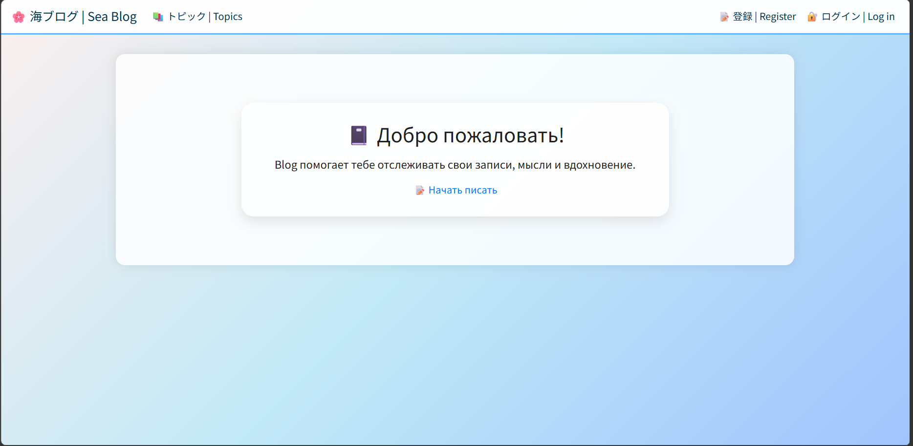

# Django Notes App — Personal Blog Service

Учебный проект на Django для ведения личных заметок.
Разработан на 2 курсе колледжа в рамках дисциплины Django.

## О проекте

Проект представляет собой веб-приложение для хранения личных заметок, структурированных по темам.

Пользователь может создавать темы, добавлять к ним записи, редактировать их и управлять своим контентом через удобный интерфейс.
Каждый пользователь работает только со своими данными благодаря системе аутентификации.

## Демо


## Задача проекта
 - изучить основы разработки на Django
 - реализовать CRUD-функционал
 - внедрить систему аутентификации пользователей
 - научиться работать с шаблонами и формами
---

## Функционал
 - регистрация и авторизация пользователей
 - вход и выход из аккаунта
 - создание тем
 - добавление заметок
 - редактирование существующих записей
 - просмотр списка тем и записей
 - разграничение доступа

## Технологии
 - Python 3.12
 - Django
 - HTML5
 - Bootstrap4
 - SQLite
---

## Роль в проекте

### Выполненные задачи:

 - разработка backend-логики на Django
 - проектирование моделей базы данных
 - реализация CRUD-операций
 - настройка аутентификации и авторизации
 - работа с Django Templates
 - создание форм и обработка пользовательского ввода
 - организация структуры проекта

## Что решает проект

Проект демонстрирует базовую архитектуру веб-приложения:

 - управление пользовательскими данными
 - реализация логики взаимодействия с БД
 - создание защищённого пользовательского пространства

## Практикуемые навыки

 - работа с Django ORM
 - создание моделей и миграций
 - обработка HTTP-запросов
 - работа с шаблонами (Templates)
 - обработка форм (Forms)
 - реализация аутентификации
 - организация структуры backend-проекта

## Структура проекта
```
django-posts-college/
├── blog/
│   ├── manage.py
│   ├── db.sqlite3
│   ├── blog/                # настройки проекта
│   │   ├── settings.py
│   │   ├── urls.py
│   │   └── ...
│   ├── blogs/               # основное приложение
│   │   ├── models.py
│   │   ├── views.py
│   │   ├── forms.py
│   │   ├── urls.py
│   │   └── templates/blogs/
│   │       ├── base.html
│   │       ├── index.html
│   │       ├── topics.html
│   │       ├── topic.html
│   │       ├── new_topic.html
│   │       ├── new_entry.html
│   │       └── edit_entry.html
│   ├── users/               # приложение пользователей
├── ll_env/                  # виртуальное окружение
```
---

## Запуск проекта
**Клонировать репозиторий:**
```
git clone https://github.com/Kirikiri2/django-posts-college.git
cd django-posts-college/blog
```
**Запустить виртуальное окружение:**
```
ll_env\Scripts\activate
```
**Запустить сервер:**
```
python manage.py runserver
```
---

## Итог

Проект помог сформировать базовое понимание backend-разработки на Django:

 - работа с базой данных
 - организация логики приложения
 - создание полноценного веб-сервиса с авторизацией

Проект стал важным этапом перехода от простых HTML/JS решений к полноценной серверной разработке.
